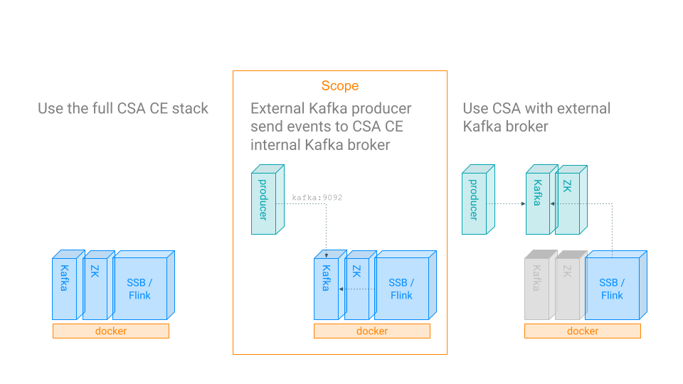

= Quick Start Kit for Cloudera Streaming Analytics (CSA) Community Edition

== What is Cloudera Streaming Analytics (CSA) and what can I use it for?
You are already using an event based architecture (e.g. Kafka) and are now thinking about how to make more out if it? How to develop it further to create added value for your business? Cloudera Stream Analytics based on Apache Flink offers exactly that! The processing logic is defined using standard SQL and allows you to gain real-time insights from your existing event streams.

At the end of October 2021, Cloudera decided to make Cloudera Streaming Analytics Community Edition (CE) available free of charge to developers.
For more detail see: https://medium.com/cloudera-inc/introducing-cloudera-streaming-analytics-community-edition-1e324b10b751[Introducing Cloudera Streaming Analytics Community Edition]

CSA CE can be used in different configs:
[TIP]
====
The examples in this repo focus on the use of an external Kafka Event producer
====

== Quickstart kit

=== Downloading the docker-compose file
Goto: https://www.cloudera.com/downloads/cdf/csa-community-edition.html

=== How to spin-up:

[source,shell script]
----
docker-compose up -d --scale flink-taskmanager=2
----

=== How to stop & clean-up:
[source,shell script]
----
docker-compose down &&
docker rm -f $(docker ps -a -q) &&
docker volume rm $(docker volume ls -q)
----

=== Add docker network to "/etc/hosts" on macos x:
[source,shell script]
----
sudo -- sh -c -e "echo '127.0.0.1   kafka' >> /etc/hosts"
----

=== bootstrap_server for Kafka producers:
[source,shell script]
----
BOOTSTRAP_SERVERS_CONFIG = kafka:9092
----

== Example Application
=== use case description
. Hello world in Streaming - xref:showcase/examples/hello_world.adoc[details]
. Temporal join of Iot / Sensor data with the latest Geo Location from RefData - xref:showcase/examples/temp_join_IoT_with_RefDataLookup.adoc[details]

=== How do

. Timestamp handling: local vs. UTC - xref:showcase/base/Timestamp_TimestampISO.adoc[details]
. Timestamp conversion - xref:showcase/base/Timestamp_conversion.adoc[details]
. Create a Table for events in CSV format - xref:showcase/base/CreateTableForCSV.adoc[details]

=== download generator:
[source,shell script]
----
wget https://github.com/zBrainiac/StreamAnalytics/releases/download/StreamAnalytics_0.0.3/StreamAnalytics-0.0.3.0.jar
----

=== some CLI commands to interact with Kafka
[source,shell script]
----
./bin/kafka-topics.sh --list --bootstrap-server kafka:9092
./bin/kafka-topics.sh --delete --bootstrap-server kafka:9092 --topic currency_code_iso  &&
./bin/kafka-topics.sh --delete --bootstrap-server kafka:9092 --topic transactions &&
----

== debugging in CSA CE
If you don't see the clear error message on the UI, get the log's
[source,shell script]
----
docker-compose logs -f sqlio
----