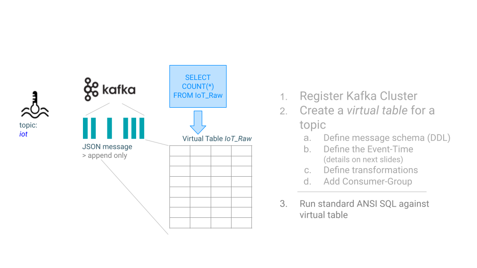

= "Hello World" in streaming

Each stream (Kafka topic) is represented in CSA as a Table. The `iot_raw` tables is representing the Kafka topic `iot`. Records in `iot` are interpreted as inserts only (append), and so the table is backed by the standard Kafka connector (connector = kafka).

== download generator:
[source,bash]
----
wget https://github.com/zBrainiac/StreamAnalytics/releases/download/StreamAnalytics_0.0.3/StreamAnalytics-0.0.3.0.jar
----

=== starting producers: `iot`

----
java -classpath StreamAnalytics-0.0.3.0.jar producer.IoTSensorSimulatorAnomaly localhost:9092
----

=== Console output

[source,shell script]
----
./bin/kafka-console-consumer.sh --bootstrap-server kafka:9092 --topic iot --property print.key=true --property key.separator=" - "

1636190810020:26 - {"sensor_ts":1636190810020,"sensor_id":26,"sensor_0":5,"sensor_1":9,"sensor_2":7,"sensor_3":29,"sensor_4":2,"sensor_5":39,"sensor_6":4,"sensor_7":46,"sensor_8":84,"sensor_9":45,"sensor_10":640,"sensor_11":1090}
1636190810225:30 - {"sensor_ts":1636190810225,"sensor_id":30,"sensor_0":5,"sensor_1":6,"sensor_2":18,"sensor_3":24,"sensor_4":39,"sensor_5":47,"sensor_6":35,"sensor_7":37,"sensor_8":42,"sensor_9":40,"sensor_10":842,"sensor_11":482}
1636190810432:6 - {"sensor_ts":1636190810432,"sensor_id":6,"sensor_0":2,"sensor_1":6,"sensor_2":14,"sensor_3":24,"sensor_4":41,"sensor_5":36,"sensor_6":42,"sensor_7":0,"sensor_8":27,"sensor_9":82,"sensor_10":254,"sensor_11":179}
1636190810637:37 - {"sensor_ts":1636190810637,"sensor_id":37,"sensor_0":1,"sensor_1":4,"sensor_2":1,"sensor_3":5,"sensor_4":2,"sensor_5":44,"sensor_6":40,"sensor_7":26,"sensor_8":42,"sensor_9":94,"sensor_10":357,"sensor_11":477}
1636190810842:36 - {"sensor_ts":1636190810842,"sensor_id":36,"sensor_0":3,"sensor_1":0,"sensor_2":10,"sensor_3":30,"sensor_4":23,"sensor_5":5,"sensor_6":54,"sensor_7":9,"sensor_8":21,"sensor_9":2,"sensor_10":569,"sensor_11":1016}
1636190811052:35 - {"sensor_ts":1636190811052,"sensor_id":35,"sensor_0":6,"sensor_1":9,"sensor_2":7,"sensor_3":14,"sensor_4":33,"sensor_5":23,"sensor_6":5,"sensor_7":58,"sensor_8":87,"sensor_9":50,"sensor_10":365,"sensor_11":742}

...
----

==  Analytics Event Streaming

Once everything is up and running, you can reach the SQL Stream Builder Console at: http://localhost:8000[localhost:8000] +
The default login and password are “admin" / "admin”.

Quick intro in how to use the Streaming SQL Console: https://docs.cloudera.com/csa/1.5.1/ssb-sql-console/topics/csa-ssb-using-console.html[official SSB DOC]

=== Create a table

[source,sql]
----
CREATE TABLE `IoT_Raw` (
`sensor_ts` BIGINT,
`sensor_id` BIGINT,
`sensor_0` BIGINT,
`sensor_1` BIGINT,
`sensor_2` BIGINT,
`sensor_3` BIGINT,
`sensor_4` BIGINT,
`sensor_5` BIGINT,
`sensor_6` BIGINT,
`sensor_7` BIGINT,
`sensor_8` BIGINT,
`sensor_9` BIGINT,
`sensor_10` BIGINT,
`sensor_11` BIGINT,
`eventTimestamp` TIMESTAMP(3) METADATA FROM 'timestamp',
WATERMARK FOR `eventTimestamp` AS `eventTimestamp` - INTERVAL '3' SECOND
) COMMENT 'IoT_Raw'
WITH (
'properties.bootstrap.servers' = 'kafka:9092',
'properties.auto.offset.reset' = 'earliest',
'connector' = 'kafka',
'format' = 'json',
'topic' = 'iot',
'properties.group.id' = 'IoT_Raw',
'scan.startup.mode' = 'earliest-offset'
);
----

=== First continuously running SQL query
[source,sql]
----
SELECT * FROM `IoT_Raw` ;
----

=== Increase the level of difficulty
well done! So let’s increase the level of difficulty and replace the existing SQL with the _HELLO WORLD_ in streaming and counting the events by sensor_id using standard SQL with GROUP BY and COUNT.
[source,sql]
----
SELECT
  `sensor_id`,
  count(*) as sensorCount
FROM `IoT_Raw`
GROUP BY `sensor_id` ;
----

=== WHERE condition / filtering

[source,sql]
----
SELECT
  `sensor_ts`,
  `sensor_id`,
  `sensor_0`,
  `sensor_1`
FROM `IoT_Raw`
WHERE `sensor_0` = 3;
----

[WARNING]
====
Make sure to stop your queries to release all resources once you finish. CSA CE is limited to a few worker tasks. You can double-check that all queries/jobs have been stopped by clicking on the SQL Jobs tab. If any jobs are still running, you can stop them from that page.
====

