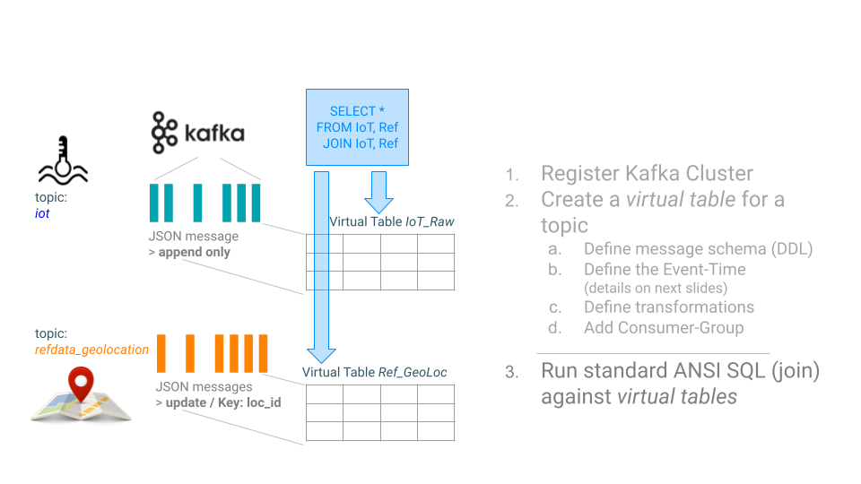

= Temporal join of IoT events with the geolocation reference data

Both tables `IoT` and `RefData_GeoLocation` are representing a Kafka topic, but in the case of RefData_GeoLocation this topic is compacted (i.e. only the most recent messages for a given key (= loc_id) are kept as updated changes flow in). Records in `iot` are interpreted as inserts only, and so the table is backed by the standard Kafka connector (connector = kafka); while the records in RefData_GeoLocation need to be interpreted as upserts based on a primary key, which requires the Upsert Kafka connector (connector = upsert-kafka).

== Use case overview:

== download generator:
[source,bash]
----
wget https://github.com/zBrainiac/StreamAnalytics/releases/download/StreamAnalytics_0.1.0/StreamAnalytics-0.2.0.0.jar
----

=== starting producers: `RefData_GeoLocation`

[source,shell script]
----
java -classpath StreamAnalytics-0.2.0.0.jar producer.RefDataGeoLocation localhost:9092
----

=== Console output
After the key is defined as an integer, an additional parameter must be given to the kafka-console-consumer:

_--key-deserializer "org.apache.kafka.common.serialization.IntegerDeserializer"_

[source,shell script]
----
./bin/kafka-console-consumer.sh --bootstrap-server localhost:9092 --topic refdata_geoLocation --property print.key=true --property key.separator=" - " --key-deserializer "org.apache.kafka.common.serialization.IntegerDeserializer"
0 - {"loc_id":0,"city":"Porrentruy","lon":47.415327,"lat":7.075221}
1 - {"loc_id":1,"city":"Geneva","lon":46.195602,"lat":6.148113}
2 - {"loc_id":2,"city":"Zürich","lon":47.366667,"lat":8.55}
3 - {"loc_id":3,"city":"Basel","lon":47.558395,"lat":7.573271}
4 - {"loc_id":4,"city":"Bern","lon":46.916667,"lat":7.466667}
5 - {"loc_id":5,"city":"Lausanne","lon":46.533333,"lat":6.666667}
6 - {"loc_id":6,"city":"Lucerne","lon":47.083333,"lat":8.266667}
...
----

=== starting producers: `iot`

----
java -classpath StreamAnalytics-0.2.0.0.jar producer.IoTSensorSimulatorAnomaly localhost:9092
----

=== Console output

[source,shell script]
----
./bin/kafka-console-consumer.sh --bootstrap-server localhost:9092 --topic iot --property print.key=true --property key.separator=" - "

1636190810020:26 - {"sensor_ts":1636190810020,"sensor_id":26,"sensor_0":5,"sensor_1":9,"sensor_2":7,"sensor_3":29,"sensor_4":2,"sensor_5":39,"sensor_6":4,"sensor_7":46,"sensor_8":84,"sensor_9":45,"sensor_10":640,"sensor_11":1090}
1636190810225:30 - {"sensor_ts":1636190810225,"sensor_id":30,"sensor_0":5,"sensor_1":6,"sensor_2":18,"sensor_3":24,"sensor_4":39,"sensor_5":47,"sensor_6":35,"sensor_7":37,"sensor_8":42,"sensor_9":40,"sensor_10":842,"sensor_11":482}
1636190810432:6 - {"sensor_ts":1636190810432,"sensor_id":6,"sensor_0":2,"sensor_1":6,"sensor_2":14,"sensor_3":24,"sensor_4":41,"sensor_5":36,"sensor_6":42,"sensor_7":0,"sensor_8":27,"sensor_9":82,"sensor_10":254,"sensor_11":179}
1636190810637:37 - {"sensor_ts":1636190810637,"sensor_id":37,"sensor_0":1,"sensor_1":4,"sensor_2":1,"sensor_3":5,"sensor_4":2,"sensor_5":44,"sensor_6":40,"sensor_7":26,"sensor_8":42,"sensor_9":94,"sensor_10":357,"sensor_11":477}
1636190810842:36 - {"sensor_ts":1636190810842,"sensor_id":36,"sensor_0":3,"sensor_1":0,"sensor_2":10,"sensor_3":30,"sensor_4":23,"sensor_5":5,"sensor_6":54,"sensor_7":9,"sensor_8":21,"sensor_9":2,"sensor_10":569,"sensor_11":1016}
1636190811052:35 - {"sensor_ts":1636190811052,"sensor_id":35,"sensor_0":6,"sensor_1":9,"sensor_2":7,"sensor_3":14,"sensor_4":33,"sensor_5":23,"sensor_6":5,"sensor_7":58,"sensor_8":87,"sensor_9":50,"sensor_10":365,"sensor_11":742}

...
----

==  Analytics Event Streaming

Once everything is up and running, you can reach the SQL Stream Builder Console at: http://localhost:8000[localhost:8000] +
The default login and password are “admin" / "admin”.

Quick intro in how to use the Streaming SQL Console: https://docs.cloudera.com/csa/1.5.1/ssb-sql-console/topics/csa-ssb-using-console.html[official SSB DOC]

=== Create a table

[source,sql]
----
SHOW Tables;
DROP TABLE `RefData_GeoLocation` IF EXISTS;

CREATE TABLE `RefData_GeoLocation` (
  `loc_id` INT,
  `city` STRING,
  `lon` DOUBLE,
  `lat` DOUBLE,
  `eventTimestamp` TIMESTAMP(3) METADATA FROM 'timestamp',
  WATERMARK FOR `eventTimestamp` AS `eventTimestamp` - INTERVAL '15' SECONDS,
  PRIMARY KEY (loc_id) NOT ENFORCED
) COMMENT 'RefData_GeoLocation'
WITH (
  'connector' = 'upsert-kafka',
  'topic' = 'refdata_geoLocation',
  'properties.bootstrap.servers' = 'localhost:9092',
  'properties.group.id' = 'RefData_GeoLocation',
  'key.format' = 'raw',
  'value.format' = 'json'
);

SELECT * FROM `RefData_GeoLocation` ;

DROP TABLE `IoT_Raw` IF EXISTS;

CREATE TABLE `IoT_Raw` (
  `sensor_ts` BIGINT,
  `sensor_id` INT,
  `sensor_0` BIGINT,
  `sensor_1` BIGINT,
  `sensor_2` BIGINT,
  `sensor_3` BIGINT,
  `sensor_4` BIGINT,
  `sensor_5` BIGINT,
  `sensor_6` BIGINT,
  `sensor_7` BIGINT,
  `sensor_8` BIGINT,
  `sensor_9` BIGINT,
  `sensor_10` BIGINT,
  `sensor_11` BIGINT,
  `eventTimestamp` TIMESTAMP(3) METADATA FROM 'timestamp',
  WATERMARK FOR `eventTimestamp` AS `eventTimestamp` - INTERVAL '3' SECOND
) COMMENT 'iot_enriched_source'
WITH (

  'connector' = 'kafka',
  'topic' = 'iot',
  'properties.bootstrap.servers' = 'localhost:9092',
  'properties.auto.offset.reset' = 'earliest',
  'format' = 'json',
  'scan.startup.mode' = 'earliest-offset',
  'properties.group.id' = 'iot'
);

SELECT * FROM `IoT_Raw` ;

SELECT
  i.`sensor_ts`,
  i.`sensor_id`,
  i.`sensor_0`,
  geo.`city`,
  geo.`lon`,
  geo.`lat`
FROM `IoT_Raw` i
JOIN `RefData_GeoLocation` FOR SYSTEM_TIME AS OF i.`eventTimestamp` AS geo
ON i.`sensor_id` = geo.`loc_id`;
----

[WARNING]
====
Make sure to stop your queries to release all resources once you finish. CSA CE is limited to a few worker tasks. You can double-check that all queries/jobs have been stopped by clicking on the SQL Jobs tab. If any jobs are still running, you can stop them from that page.
====