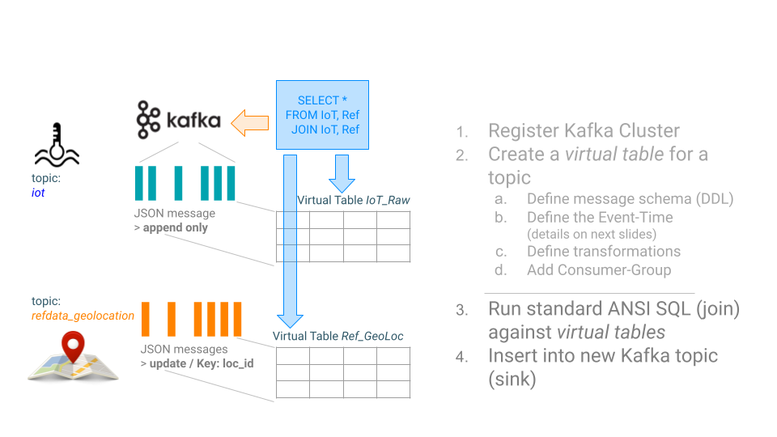
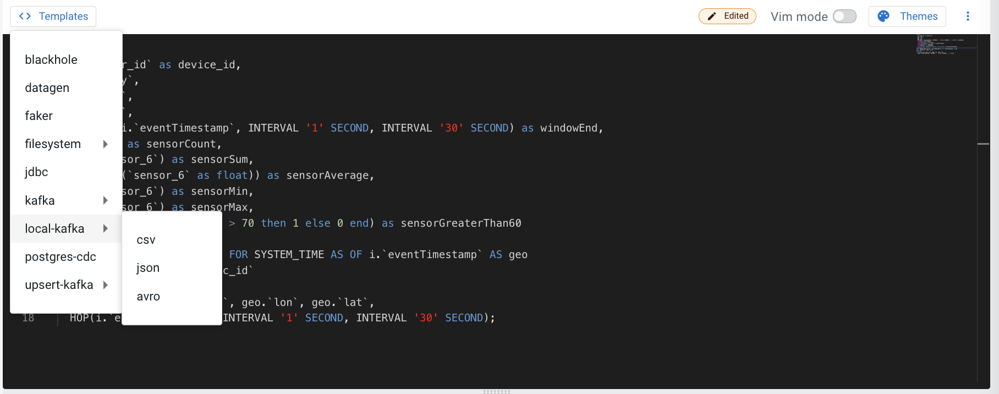
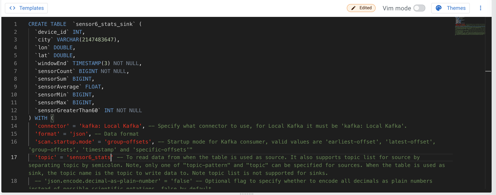
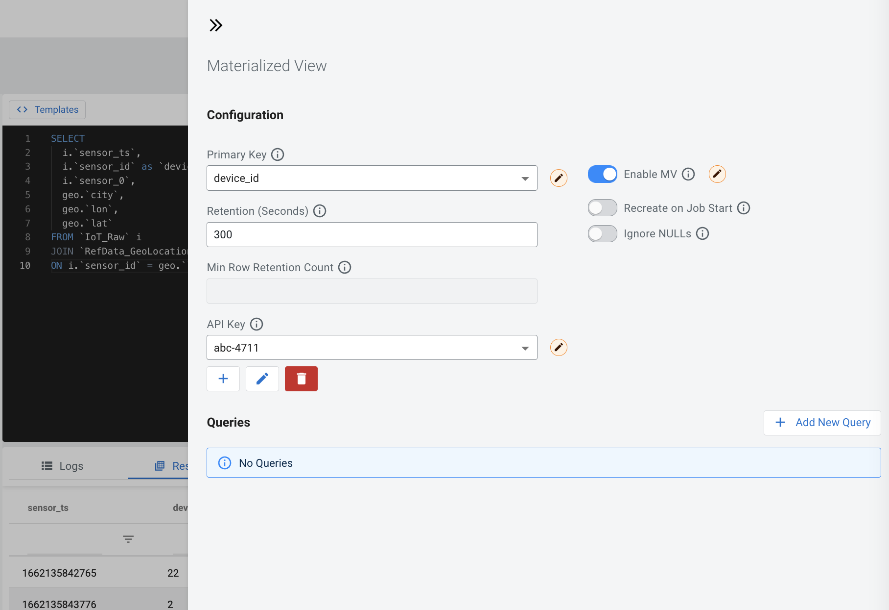
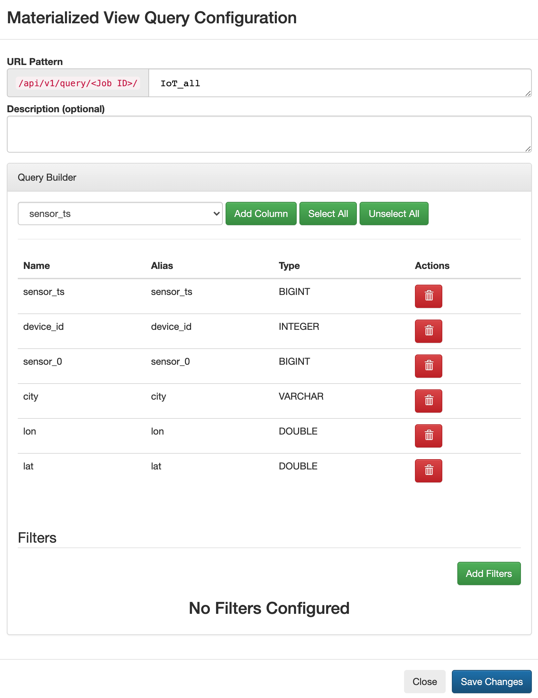
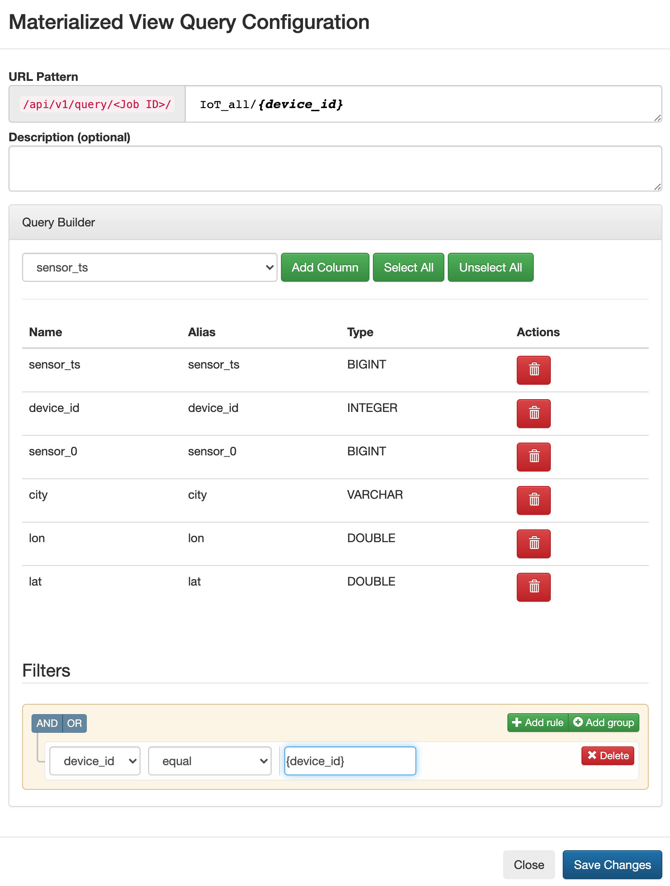
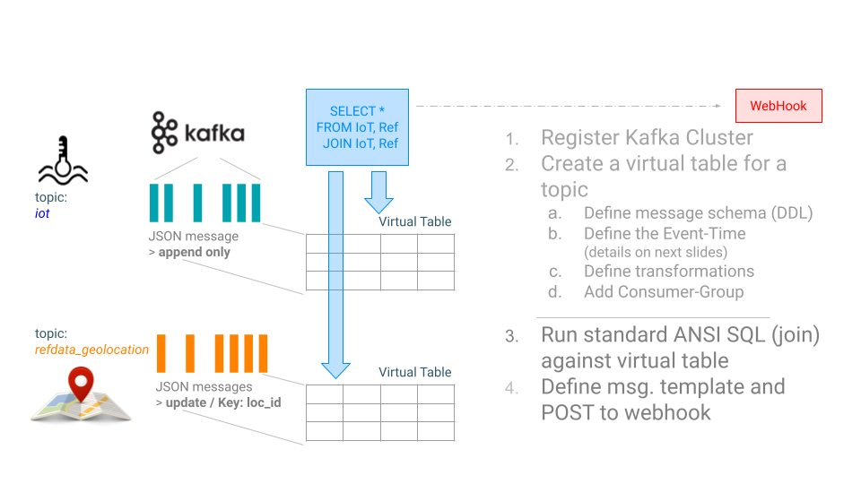
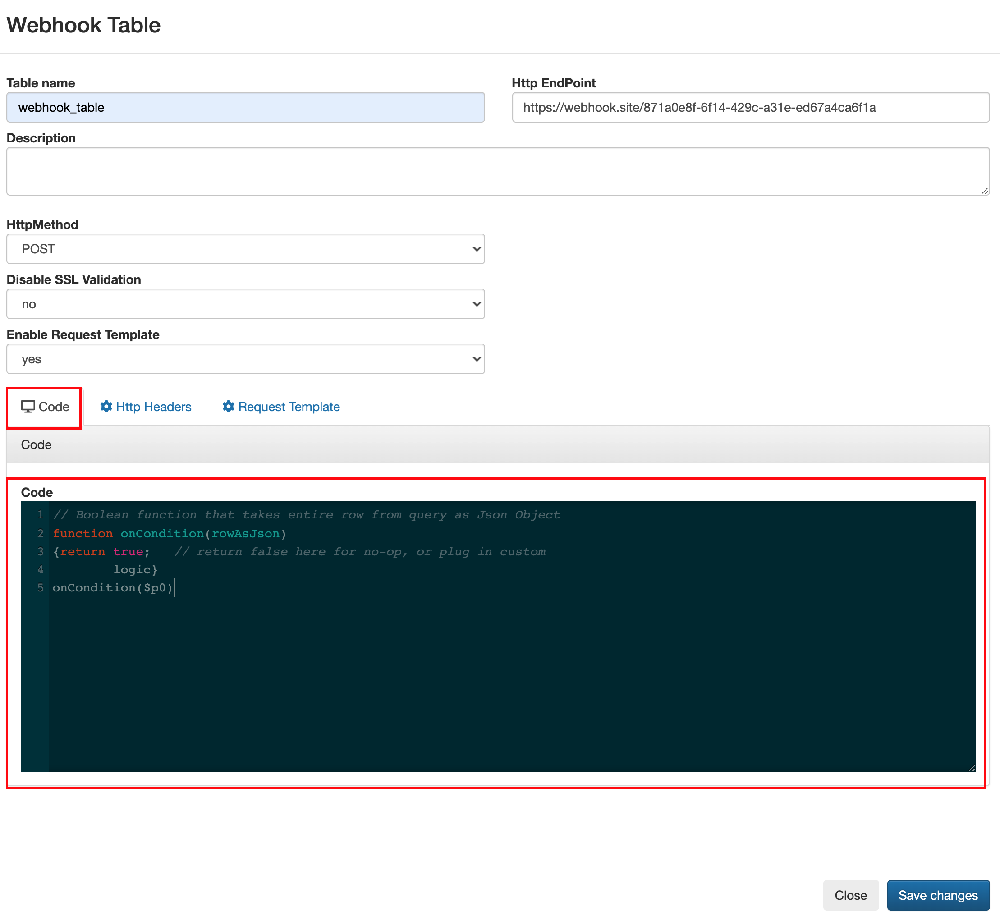
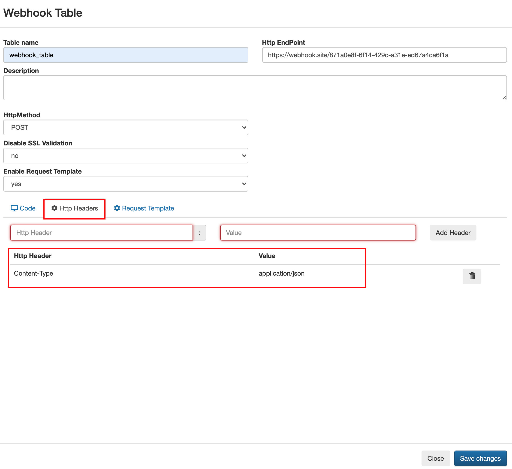
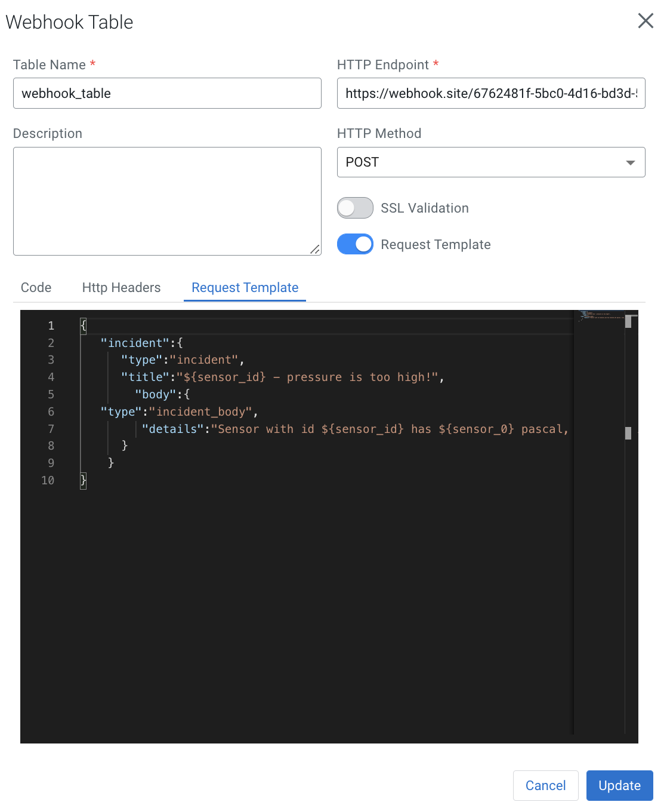

= End-to-End example

Before we start with the first _Stream Analytics_ lab we have to set up the local infrastructure.

==  Add `kafka` to /etc/hosts:

On Unix based environments you can do it with the following command as an alternative you can also modify /etc/hots with your favorite editor.

```
sudo -- sh -c -e "echo '127.0.0.1   kafka' >> /etc/hosts"
```

== download event generator:
[source,bash]
----
wget https://github.com/zBrainiac/StreamAnalytics/releases/download/StreamAnalytics_0.1.0/StreamAnalytics-0.2.0.0.jar
----

==== starting producers: `RefData_GeoLocation`

[source,shell script]
----
java -classpath StreamAnalytics-0.2.0.0.jar producer.RefDataGeoLocation localhost:9092
----

==== Console output
If you don't have a local Kafka installation log into the docker container where Kafka is running (see below) and execute the following command.

After the key is defined as an integer, an additional parameter must be given to the kafka-console-consumer:

_--key-deserializer "org.apache.kafka.common.serialization.IntegerDeserializer"_

[source,shell script]
----
./bin/kafka-console-consumer.sh --bootstrap-server localhost:9092 --topic refdata_geoLocation --property print.key=true --property key.separator=" - " --key-deserializer "org.apache.kafka.common.serialization.IntegerDeserializer"
0 - {"loc_id":0,"city":"Porrentruy","lon":47.415327,"lat":7.075221}
1 - {"loc_id":1,"city":"Geneva","lon":46.195602,"lat":6.148113}
2 - {"loc_id":2,"city":"Zürich","lon":47.366667,"lat":8.55}
3 - {"loc_id":3,"city":"Basel","lon":47.558395,"lat":7.573271}
4 - {"loc_id":4,"city":"Bern","lon":46.916667,"lat":7.466667}
5 - {"loc_id":5,"city":"Lausanne","lon":46.533333,"lat":6.666667}
6 - {"loc_id":6,"city":"Lucerne","lon":47.083333,"lat":8.266667}
...
----

==== starting producers: `iot`

----
java -classpath StreamAnalytics-0.2.0.0.jar producer.IoTSensorSimulatorAnomaly localhost:9092
----

==== Console output
If you don't have a local Kafka installation log into the docker container where Kafka is running (see below) and execute the following command:

[source,shell script]
----
./bin/kafka-console-consumer.sh --bootstrap-server localhost:9092 --topic iot --property print.key=true --property key.separator=" - "

1636190810020:26 - {"sensor_ts":1636190810020,"sensor_id":26,"sensor_0":5,"sensor_1":9,"sensor_2":7,"sensor_3":29,"sensor_4":2,"sensor_5":39,"sensor_6":4,"sensor_7":46,"sensor_8":84,"sensor_9":45,"sensor_10":640,"sensor_11":1090}
1636190810225:30 - {"sensor_ts":1636190810225,"sensor_id":30,"sensor_0":5,"sensor_1":6,"sensor_2":18,"sensor_3":24,"sensor_4":39,"sensor_5":47,"sensor_6":35,"sensor_7":37,"sensor_8":42,"sensor_9":40,"sensor_10":842,"sensor_11":482}
1636190810432:6 - {"sensor_ts":1636190810432,"sensor_id":6,"sensor_0":2,"sensor_1":6,"sensor_2":14,"sensor_3":24,"sensor_4":41,"sensor_5":36,"sensor_6":42,"sensor_7":0,"sensor_8":27,"sensor_9":82,"sensor_10":254,"sensor_11":179}
1636190810637:37 - {"sensor_ts":1636190810637,"sensor_id":37,"sensor_0":1,"sensor_1":4,"sensor_2":1,"sensor_3":5,"sensor_4":2,"sensor_5":44,"sensor_6":40,"sensor_7":26,"sensor_8":42,"sensor_9":94,"sensor_10":357,"sensor_11":477}
1636190810842:36 - {"sensor_ts":1636190810842,"sensor_id":36,"sensor_0":3,"sensor_1":0,"sensor_2":10,"sensor_3":30,"sensor_4":23,"sensor_5":5,"sensor_6":54,"sensor_7":9,"sensor_8":21,"sensor_9":2,"sensor_10":569,"sensor_11":1016}
1636190811052:35 - {"sensor_ts":1636190811052,"sensor_id":35,"sensor_0":6,"sensor_1":9,"sensor_2":7,"sensor_3":14,"sensor_4":33,"sensor_5":23,"sensor_6":5,"sensor_7":58,"sensor_8":87,"sensor_9":50,"sensor_10":365,"sensor_11":742}

...
----

==  Create new Kafka topic for the query result

Get all running containers with `docker ps`

[source,shell]
----
$ docker ps
CONTAINER ID   IMAGE                                                                 COMMAND                  CREATED          STATUS                    PORTS                                              NAMES
be359da4753e   docker.repository.cloudera.com/csa/ssb-docker_flink:1.6.0.0-ce        "/usr/bin/init-flink…"   57 minutes ago   Up 57 minutes                                                                ssb-flink-taskmanager-1
b6561fb239c3   docker.repository.cloudera.com/csa/ssb-docker_flink:1.6.0.0-ce        "/usr/bin/init-flink…"   57 minutes ago   Up 57 minutes                                                                ssb-flink-taskmanager-2
50d266fd87af   docker.repository.cloudera.com/csa/ssb-docker_console:1.6.0.0-ce      "/opt/cloudera/entry…"   57 minutes ago   Up 56 minutes             0.0.0.0:8000->8000/tcp, 0.0.0.0:18111->18111/tcp   ssb-console-1
35b0e660b2de   docker.repository.cloudera.com/csa/ssb-docker_kafka:1.6.0.0-ce        "/usr/bin/init-kafka"    57 minutes ago   Up 56 minutes (healthy)   0.0.0.0:9092->9092/tcp                             ssb-kafka-1
cbd7e5c81c8d   docker.repository.cloudera.com/csa/ssb-docker_sqlio:1.6.0.0-ce        "/opt/cloudera/sqlio…"   57 minutes ago   Up 57 minutes (healthy)   0.0.0.0:18121->18121/tcp                           ssb-sqlio-1
33c64fccfcef   docker.repository.cloudera.com/csa/ssb-docker_zookeeper:1.6.0.0-ce    "/usr/bin/init-zooke…"   57 minutes ago   Up 57 minutes (healthy)   0.0.0.0:2181->2181/tcp                             ssb-zookeeper-1
b61c270719e2   docker.repository.cloudera.com/csa/ssb-docker_postgresql:1.6.0.0-ce   "pg_ctlcluster 12 ma…"   57 minutes ago   Up 57 minutes             0.0.0.0:5432->5432/tcp                             ssb-postgresql-1
69ca1ba7bde9   docker.repository.cloudera.com/csa/ssb-docker_snapper:1.6.0.0-ce      "/opt/cloudera/snapp…"   57 minutes ago   Up 57 minutes             8081/tcp, 0.0.0.0:18131->18131/tcp                 ssb-snapper-1
e40b8e0215fd   docker.repository.cloudera.com/csa/ssb-docker_flink:1.6.0.0-ce        "/usr/bin/init-flink…"   57 minutes ago   Up 57 minutes (healthy)   0.0.0.0:8081->8081/tcp                             ssb-flink-jobmanager-1
----
As you can see the Kafka broker is running in container = `35b0e660b2de`
Login into the Kafka container
[source,shell ]
----
$ docker exec -it 35b0e660b2de /bin/bash
----

After login:

. change into the kafka directory
cd /opt/kafka
. get a list of all kafka topics
. create a new kafka topics `sensor6_stats` with replication-factor 1 --partitions 1
. check again the list of kafka topics


[source,shell ]
----
kafka@35b0e660b2de:~$ cd /opt/kafka

kafka@35b0e660b2de:/opt/kafka$ ./bin/kafka-topics.sh --list --bootstrap-server localhost:9092
__consumer_offsets
__smm_producer_metrics
iot
refdata_geoLocation

kafka@35b0e660b2de:/opt/kafka$ ./bin/kafka-topics.sh --create --bootstrap-server localhost:9092 --replication-factor 1 --partitions 1 --topic sensor6_stats

Created topic sensor6_stats.

kafka@35b0e660b2de:/opt/kafka$ ./bin/kafka-topics.sh --list --bootstrap-server localhost:9092
__consumer_offsets
__smm_producer_metrics
iot
refdata_geoLocation
sensor6_stats

kafka@35b0e660b2de:/opt/kafka$ exit

----

==  Analytics Event Streaming

Once everything is up and running, you can reach the SQL Stream Builder Console at: http://localhost:18121[localhost:18121] +
The default login and password are “admin" / "admin”.

Quick intro in how to use the Streaming SQL Console: https://docs.cloudera.com/csa/1.7.0/index.html[official SSB DOC]

=== Create basic tables

[source,sql]
----
SHOW Tables;
DROP TABLE `RefData_GeoLocation`;

CREATE TABLE `RefData_GeoLocation` (
  `loc_id` INT,
  `city` STRING,
  `lon` DOUBLE,
  `lat` DOUBLE,
  `eventTimestamp` TIMESTAMP(3) METADATA FROM 'timestamp',
  WATERMARK FOR `eventTimestamp` AS `eventTimestamp` - INTERVAL '15' SECONDS,
  PRIMARY KEY (loc_id) NOT ENFORCED
) COMMENT 'RefData_GeoLocation'
WITH (
  'connector' = 'upsert-kafka',
  'topic' = 'refdata_geoLocation',
  'properties.bootstrap.servers' = 'kafka:9092',
  'properties.group.id' = 'RefData_GeoLocation',
  'key.format' = 'raw',
  'value.format' = 'json'
);


DROP TABLE `IoT_Raw`;

CREATE TABLE `IoT_Raw` (
  `sensor_ts` BIGINT,
  `sensor_id` INT,
  `sensor_0` BIGINT,
  `sensor_1` BIGINT,
  `sensor_2` BIGINT,
  `sensor_3` BIGINT,
  `sensor_4` BIGINT,
  `sensor_5` BIGINT,
  `sensor_6` BIGINT,
  `sensor_7` BIGINT,
  `sensor_8` BIGINT,
  `sensor_9` BIGINT,
  `sensor_10` BIGINT,
  `sensor_11` BIGINT,
  `eventTimestamp` TIMESTAMP(3) METADATA FROM 'timestamp',
  WATERMARK FOR `eventTimestamp` AS `eventTimestamp` - INTERVAL '3' SECOND
) COMMENT 'iot_enriched_source'
WITH (
  'connector' = 'kafka',
  'topic' = 'iot',
  'properties.bootstrap.servers' = 'kafka:9092',
  'properties.auto.offset.reset' = 'earliest',
  'format' = 'json',
  'scan.startup.mode' = 'earliest-offset',
  'properties.group.id' = 'iot'
);
----

[source,sql]
----
SHOW Tables;
SELECT * FROM IoT_Raw ;
SELECT count(*) FROM IoT_Raw ;
SELECT sensor_ts, sensor_id, sensor_0, sensor_1, sensor_2, eventTimestamp FROM IoT_Raw ;
----

== Overview: use case - Publish results to Kafka[resultKafka]

Both tables `IoT` and `RefData_GeoLocation` are representing a Kafka topic, but in the case of `RefData_GeoLocation` this topic is compacted (i.e. only the most recent messages for a given key (= loc_id) are kept as updated changes flow in). Records in `iot` are interpreted as inserts only, and so the table is backed by the standard Kafka connector = kafka); while the records in `RefData_GeoLocation` need to be interpreted as upserts based on a primary key, which requires the Upsert Kafka connector (connector = upsert-kafka).




=== Create a query
This query will compute aggregates over 30-seconds windows that slide forward every second. For a specific sensor value in the record (`sensor_6`) it computes the following aggregations for each window:

* Number of events received
* Sum of the `sensor_6` value for all the events
* Average of the `sensor_6` value across all the events
* Min and max values of the `sensor_6` field
* Number of events for which the `sensor_6` value exceeds `70`

On the SSB UI:

. Click on Console (on the left bar) *> Compose > SQL*
+
. Create new job, enter e.g. `Sensor6Stats` for the *SQL Job Name* field.
+
. In the SQL box type the query shown below.
+
[source,sql]
----
SELECT
  i.`sensor_id` as device_id,
  geo.`city`,
  geo.`lon`,
  geo.`lat`,
  HOP_END(i.`eventTimestamp`, INTERVAL '1' SECOND, INTERVAL '30' SECOND) as windowEnd,
  count(*) as sensorCount,
  sum(`sensor_6`) as sensorSum,
  avg(cast(`sensor_6` as float)) as sensorAverage,
  min(`sensor_6`) as sensorMin,
  max(`sensor_6`) as sensorMax,
  sum(case when `sensor_6` > 70 then 1 else 0 end) as sensorGreaterThan60
FROM `IoT_Raw` i
JOIN `RefData_GeoLocation` FOR SYSTEM_TIME AS OF i.`eventTimestamp` AS geo
ON i.`sensor_id` = geo.`loc_id`
GROUP BY
  i.`sensor_id`, geo.`city`, geo.`lon`, geo.`lat`,
  HOP(i.`eventTimestamp`, INTERVAL '1' SECOND, INTERVAL '30' SECOND);
----

. Before you can execute this query, though, the `sensor6_stats_sink` table must be created in SSB, mapping it to the `sensor6_stats` Kafka topic.

+
. Since we want the topic format to be JSON, click on *Templates > local-kafka > JSON*.
+


. This will prepend a `CREATE TABLE` DDL to the SQL script to create a table that matches the structure of your query! Adjusted the name e.g. `sensor6_stats_sink`
+

+
. Most of the table properties are already filled in for you. But there's one you must edit before you execute the statement: the `topic` property.
+
Edit the DDL statement and replace the `...` value of the `topic` property with the actual topic name: `sensor6_stats`.
+
image::../../images/template-table-edited.png[width=300]
+
. Click *Execute* to create the sink table
+
. Copy & past the SQL box again, this time including a`sensor6_stats_sink` statement on top.
+
[source,sql]
----
INSERT INTO sensor6_stats_sink
SELECT
  i.`sensor_id` as device_id,
  geo.`city`,
  geo.`lon`,
  geo.`lat`,
  HOP_END(i.`eventTimestamp`, INTERVAL '1' SECOND, INTERVAL '30' SECOND) as windowEnd,
  count(*) as sensorCount,
  sum(`sensor_6`) as sensorSum,
  avg(cast(`sensor_6` as float)) as sensorAverage,
  min(`sensor_6`) as sensorMin,
  max(`sensor_6`) as sensorMax,
  sum(case when `sensor_6` > 70 then 1 else 0 end) as sensorGreaterThan60
FROM `IoT_Raw` i
JOIN `RefData_GeoLocation` FOR SYSTEM_TIME AS OF i.`eventTimestamp` AS geo
ON i.`sensor_id` = geo.`loc_id`
GROUP BY
  i.`sensor_id`, geo.`city`, geo.`lon`, geo.`lat`,
  HOP(i.`eventTimestamp`, INTERVAL '1' SECOND, INTERVAL '30' SECOND);
----
+
. Let’s query the `sensor6_stats` topic to examine the data that is being written to it. Create a new job via `+ New Job`
+
NOTE: The `sensor6_stats` job will continue to run in the background. You can monitor and manage it through the *SQL Jobs* page.

+
[source,sql]
----
CREATE TABLE `sensor6_stats_source` (
    `device_id` BIGINT,
    `device_id` BIGINT,
    `city` STRING,
    `lon` DOUBLE,
    `lat` DOUBLE,
    `windowEnd` STRING,
    `sensorCount` BIGINT,
    `sensorSum` BIGINT,
    `sensorAverage` DOUBLE,
    `sensorMin` BIGINT,
    `sensorMax` BIGINT,
    `sensorGreaterThan60` BIGINT,
    `eventTimestamp` TIMESTAMP(3) METADATA FROM 'timestamp',  WATERMARK FOR `eventTimestamp` AS `eventTimestamp` - INTERVAL '3' SECOND)
WITH (
  'properties.bootstrap.servers' = 'kafka:9092',
  'properties.auto.offset.reset' = 'earliest',
  'connector' = 'kafka',
  'format' = 'json',
  'topic' = 'sensor6_stats',
  'scan.startup.mode' = 'earliest-offset',
  'properties.group.id' = 'sensor6_stats_source-consumer-1'
);
----
+
Enter the following query in the SQL field and execute it:
+
[source,sql]
----
SELECT * FROM sensor6_stats_source ;
----
+
[WARNING]
====
Make sure to stop your queries to release all resources once you finish. CSA CE is limited to a few worker tasks. You can double-check that all queries/jobs have been stopped by clicking on the SQL Jobs tab. If any jobs are still running, you can stop them from that page.
====


== Overview: Use case - Expose steaming events via REST API


SQL Stream Builder can also take keyed snapshots of the data stream and make that available through a REST interface in the form of materialized views. In this lab you’ll create and query Materialized Views (MV).

System setup same as before: Both tables `IoT` (insert) and `RefData_GeoLocation` (upsert) are representing a Kafka topic.

image::../../images/TemporalJoinIoTSensorWithLatestGeoLocInsertIntoREST.png[width=800]

=== Create a query

On the SSB UI:

. Click on Console (on the left bar) *> Compose > SQL*
+
. Enter `Expose_IoTLoc` for the *SQL Job Name* field.
+
. In the SQL box type the query shown below.
+
[source,sql]
----
SELECT
  i.`sensor_ts`,
  i.`sensor_id` as `device_id`,
  i.`sensor_0`,
  geo.`city`,
  geo.`lon`,
  geo.`lat`
FROM `IoT_Raw` i
JOIN `RefData_GeoLocation` FOR SYSTEM_TIME AS OF i.`eventTimestamp` AS geo
ON i.`sensor_id` = geo.`loc_id`;
----
+
. In order to add Materialized Views to a query the job needs to be stopped. On the job page, click the Stop button to pause the job.

. Click on the *Materialized View* button and set the following properties:
+
[source,python]
----
Enable VM:             Enabled
Primary Key:           device_id
Retention:             300
----
+


. To access the REST API of a MV you need to have an API Key.
The API key is the information given to clients so that they can access the MVs.
If you have multiple MVs and want them to be accessed by different clients you can have multiple API keys to control access to the different MVs.
+
If you have already created an API Key in SSB you can select it from the drop-down list.
Otherwise, create one on the spot by clicking on the *Add API Key* button shown above.
Use `abc-4711` as the Key Name.

. Click *Add Query* to create a new MV.
You will create a view that shows all the devices for which `sensor6` has had at least 1 reading above 60 in the last recorded 30-second window.
For this, enter the following parameters in the MV Query Configuration page:
+
[source,python]
----
URL Pattern:   IoT_all
Query Builder: <click "Select All" to add all columns>
----
+


. Click *Apply and Save Job*.

. Go back to the *SQL* tab and click on *Execute* to start the job.

. On the *Materialized Views* tab, copy the new MV URL that's shown on the screen and open it in a new browser tab (or simply click on the URL link).
You will see the content of the MV current snapshot.
+
If you refresh the page a few times you will notice that the MV snapshot is updated as new data points are coming through the stream.
+
SSB keeps the last state of the data for each value of the defined primary key.
+
image::../../images/mv-contents.png[width=800]

==== Materialized View with parameters

The MV you created above takes no parameters; it always returns the full content of the MV when you call the REST endpoint.
It is possible to specify parameters for a MV so that you can filter the contents at query time.

In this section you will create a new REST API that allows filtering by specifying a range for the `sensorAverage` column.

. First, stop the job again so that you can add another REST API.

. On the *Materialized Views* tab, click on the *Add New Query* button to create a new MV, enter the following parameter and click *Save Changes*.
+
[source,python]
----
URL Pattern:   IoT/{device_id}
Query Builder: <click "Select All" to add all columns>
Filters:       device_id  equal  {device_id}
----
+


. You will notice that the new URL for this REST API has a placeholder for the `{device_id}` parameter:
+

. Go back to the *SQL* tab and execute the job again.

. Click on the *Materialize Views* tab, and copy&paste the link for the MV that you just created.

. Adjust {device_id} in the URI with a valid value e.g. 12

+
[WARNING]
====
Make sure to stop your queries to release all resources once you finish. CSA CE is limited to a few worker tasks. You can double-check that all queries/jobs have been stopped by clicking on the SQL Jobs tab. If any jobs are still running, you can stop them from that page.
====


== Overview: Use case - Perform an HTTP action (webhook)

Webhooks are _"user-defined HTTP callbacks"_. They are usually triggered by some event, such an action being triggered by a user or an alarm fired up. When that event occurs, the source site makes an HTTP request to the URL configured for the webhook. Users can configure them to cause events on one site to invoke behavior on another.

System setup same as before: Both tables `IoT` (insert) and `RefData_GeoLocation` (upsert) are representing a Kafka topic.



First you have to configure the *webhook table* to perform an HTTP action per message (sql result).

WARNING: Open new browser in _incognito mode_ and create a new http endpoint at https://webhook.site

. Select SQL Console / new job from the main menu.
. Select *Add table > Webhook*. The *Webhook Table* window appears.
+

[source,shell]
----
Table name              webhook_table
Http EndPoint           webhook <Your unique URL endpoint https:// >
HttpMethod              POST
Disable SSL Validation  no
Enable Request Template yes
----
+
. In the *Code* tab, you can specify a code block that controls how the webhook displays the data.
For a webhook that is called for each message the following code is used:
+

+
[source,javascript]
----
// Boolean function that takes entire row from query as Json Object
function onCondition(rowAsJson)
{return true;   // return false here for no-op, or plug in custom
        logic}
onCondition($p0)
----
+
. On the *Http Headers* tab, add HTTP headers using the HTTP Headers tab, if needed.
+

+
[source,shell]
----
Http Header     Content-Type
Value           application/json
----
+
. Press the *Add Header* sign to save
. On the *Request Template* tab modify template
+

+
[source,javascript]
----
{
   "incident":{
      "type":"incident",
      "title":"${sensor_id} - pressure is too high!",
        "body":{
   "type":"incident_body",
         "details":"Sensor with id ${sensor_id} has ${sensor_0} pascal, City:${city}, GeoLoc:${lon},${lat}"
      }
    }
}
----
. Click *Save changes*

=== Create a query
On the SSB UI:

. Click on Console (on the left bar) *> Compose > SQL*
+
. Enter `webhook_IoTLoc` for the *SQL Job Name* field.
+
. In the SQL box type the query shown below.
+
[source,sql]
----
INSERT INTO webhook_table
SELECT
  i.`sensor_ts`,
  i.`sensor_id`,
  i.`sensor_0`,
  geo.`city`,
  geo.`lon`,
  geo.`lat`
FROM `IoT_Raw` i
JOIN `RefData_GeoLocation` FOR SYSTEM_TIME AS OF i.`eventTimestamp` AS geo
ON i.`sensor_id` = geo.`loc_id`;
----
+
. Click *Execute* query
. Back on the https://webhook.site page you will see the submitted messages

+
[WARNING]
====
Make sure to stop your queries to release all resources once you finish. CSA CE is limited to a few worker tasks. You can double-check that all queries/jobs have been stopped by clicking on the SQL Jobs tab. If any jobs are still running, you can stop them from that page.
====